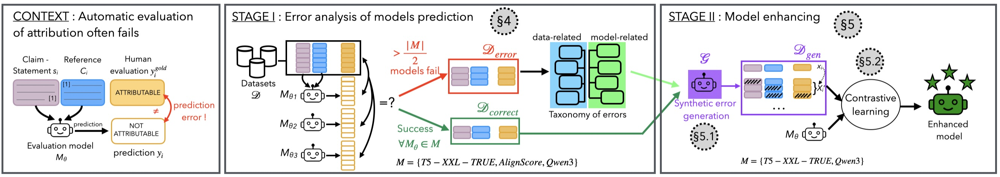

# ContAttriEval

Code for submitted paper: A Contrastive Framework for Enhanced Automatic Attribution
Evaluation Through Error Generation

In this paper we follow a two-stage methodology to enhance model performances:

1. Analysis of Attribution evaluation Error types by examining 3 SOTA models (T5-XXL-True, AlignScore, Qwen3-4B)
2. Model Enhancement:
   - Synthetic Error Generation
   - Model Training through a contrastive objective


# Stage 1: 
We provide extended examples of all error types identified in our Prelimaniry analysis and according to our taxonomy:

| Category | Example |
| :--- | :--- |
| **Label error (E1)** | **$s_i$**: To determine whether a drug is an agonist or antagonist of a receptor in molecular pharmacology, C) you will need to combine functional and binding experiments [1] [2]. <br><br> **$C_i$**: ["Access Denied... Your access to the NCBI website at www.ncbi.nlm.nih.gov has been temporarily blocked due to a possible misuse/abuse situation..."] |
| **Subjective (E3)** | **$s_i$**: The belief in Greek gods is called Ancient Greek religion. <br><br> **$C_i$**: ["Title: Ancient Greek religion. Most ancient Greeks recognized the twelve major Olympian gods and goddesses—Zeus, Hera, Poseidon, Demeter, Athena, Ares, Aphrodite, Apollo, Artemis, Hephaestus, Hermes, and either Hestia or Dionysus..."] <br><br> **NLI**: 1; **ALIGNSCORE**: 0.98; **Label**: Not Attributable <br> *Interpretation of 'called' as the name of the religion or the definition.* |
| **Subjective (E3) cont.** | **$s_i$**: UNESCO inaugurated 'World Teachers' Day'. <br><br> **$C_i$**: ["Title: World Teachers' Day... Established in 1994, it commemorates the signing of the 1966 UNESCO/ILO Recommendation concerning the Status of Teachers..."] <br><br> **NLI**: 0; **ALIGNSCORE**: 0.182; **Label**: Attributable <br> *Interpretation of 'inaugurated' and 'established'.* |
| **Relevance / Token Overlap** | **$s_i$**: The road that connects the tombs is called the spirit way. <br><br> **$C_i$**: ["Title: Ming tombs. A 7-kilometer road named the 'Spirit Way' (pinyin: Shéndào) leads into the complex..."] <br><br> **NLI**: 1; **ALIGNSCORE**: 0.97; **Label**: Not Attributable <br> *Interpretation: mention the name and describing the roads.* |
| **Relevance / Token Overlap cont.** | **$s_i$**: Rocky Dzidzornu plays the bongos on 'Sympathy for the Devil.' <br><br> **$C_i$**: ["Title: Rocky Dzidzornu. Critic Ned Sublette has written that the addition of his conga drumming on 'Sympathy for the Devil' transformed the song from 'a dirge, and a dull one at that . . . making it come alive'."] <br><br> **NLI**: 0; **ALIGNSCORE**: 0.017; **Label**: Attributable <br> *Conflict: bongos vs conga.* |
| **Fine-grained sensitivity (E5)** | **$s_i$**: At an altitude of 7000 **meters** above sea level, water boils at approximately 92.7°C (198.9°F). <br><br> **$C_i$**: At 7,000 **feet** water boils 92.7C (198.9F). <br><br> **NLI**: 1; **ALIGNSCORE**: 0.91; **Label**: Not Attributable |
| **Conflicting Sources (E9)** | **$s_i$**: The best selling album of 2017 was Taylor Swift’s "Reputation". [1][2] <br><br> **$C_i$**: [1] Taylor Swift’s "Reputation" was the best selling album of 2017... [2] ...In the US, the album sold 1.216 million copies... making it **the country’s best-selling album**, while globally it was the **second best-selling album** of 2017 worldwide. <br><br> **NLI**: 1; **ALIGNSCORE**: 0.98; **Label**: Not Attributable |
| **Fact Synthesis (E7)** | **$s_i$**: The first overseas branch of Bible Students was opened in London in 1900, and a German branch office of the Watch Tower Society opened in Elberfeld in 1902. <br><br> **$C_i$**: [1] A German branch office of the Watch Tower Society opened in Elberfeld in 1902. [2] Bible Student missionaries were sent to England in 1881 and the first overseas branch was opened in London in 1900. <br><br> **NLI**: 0; **ALIGNSCORE**: 0.0; **Label**: Attributable |

# Stage 2
## Synthetic Error Generation
Different prompts for generating different types of errors can be found in:
```
prompts.json
```

To augment a dataset with generated errors:
```
python error_gen/scripts/gen_negative_examples.py --data_file {file}  --prompt_model_name Qwen/Qwen3-30B-A3B-Instruct-2507

```
## Model Training

We repurpose alignement-handbook to implement the training code in model_training


We report results on AttributuonBench and TrueBenchmark
